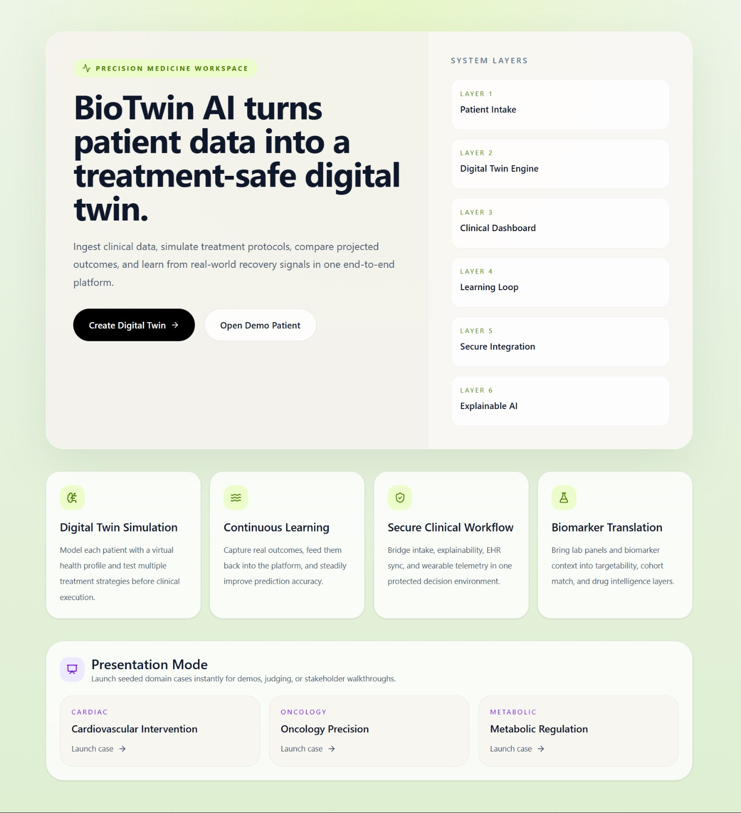
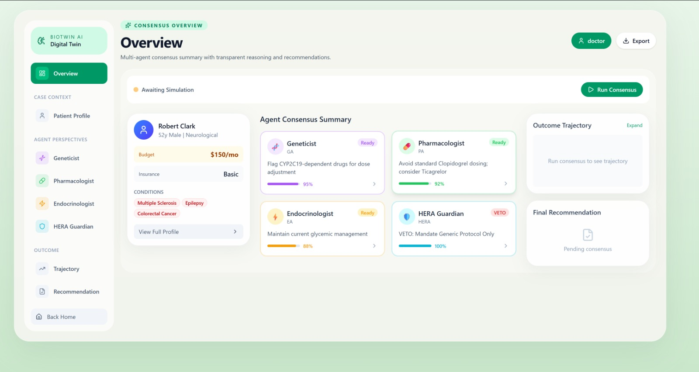
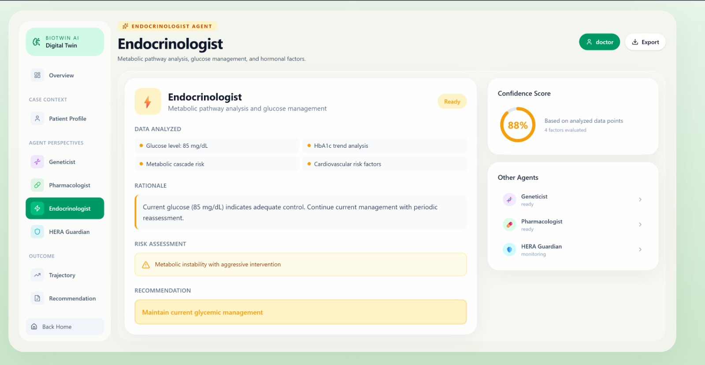
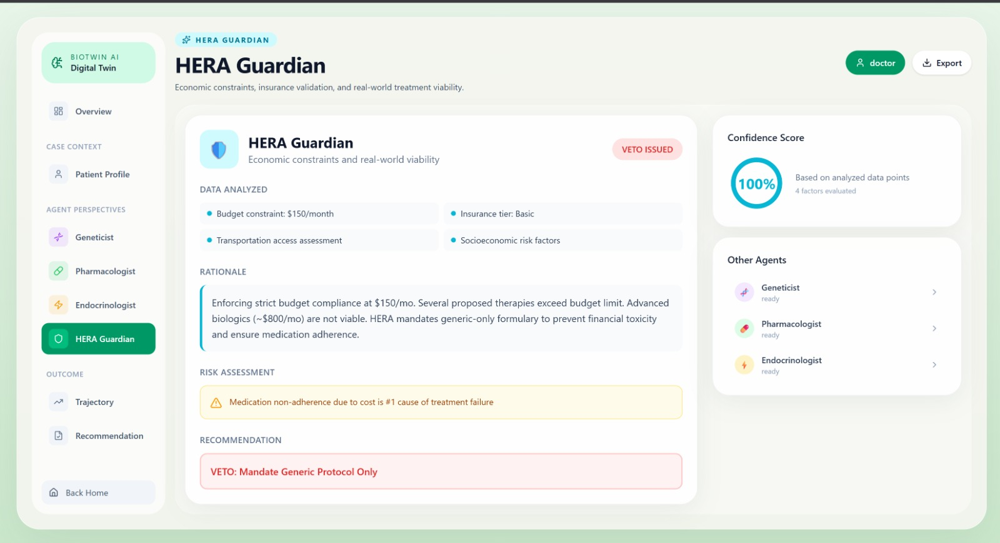
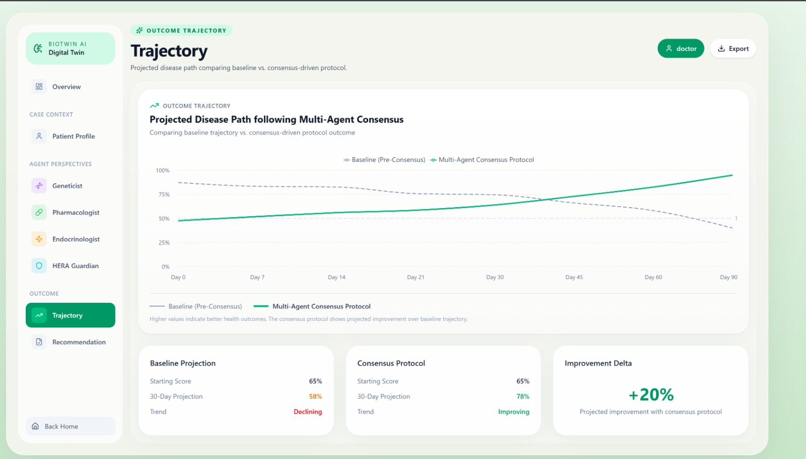

<h1 align="center">BioTwin AI</h1>

<p align="center">
  <strong>Next-Generation Personalized Medicine Platform</strong><br>
  <em>Multi-Agent AI System for Digital Twin Creation, Treatment Simulation & Clinical Decision Support</em>
</p>

<p align="center">
  
  
  
  
  
</p>

---

## Overview

**BioTwin AI** creates a **digital twin** of patients, simulates treatment strategies using **multi-agent AI consensus**, provides **explainable AI (XAI)** insights, and continuously learns from real-world outcomes.

---

## Screenshots

| Screen | Description |
|--------|-------------|
|  | Landing page with 6-layer architecture overview |
|  | 9-step precision intake form |
|  | Clinical dashboard with AI agent consensus |
|  | Complete patient digital twin profile |
|  | Pharmacogenomic analysis (95% confidence) |
|  | Drug safety review (92% confidence) |
|  | Metabolic assessment (88% confidence) |
|  | Economic constraints & veto authority |
|  | Outcome trajectory visualization |
|  | Final consensus treatment protocol |

---

## Key Features

| Feature | Description |
|---------|-------------|
| **Digital Twin Engine** | Creates computable patient models from clinical data |
| **Multi-Agent AI Consensus** | 4 specialized AI agents collaborate on treatment plans |
| **Treatment Simulation** | Compare Conservative, Standard, and Aggressive protocols |
| **Explainable AI (XAI)** | Transparent reasoning with feature importance analysis |
| **Human-in-the-Loop (HITL)** | Clinicians can steer AI deliberations in real-time |
| **Continuous Learning** | System improves from real-world outcome feedback |
| **Dynamic Agent Swarming** | Agents spawn sub-agents when complexity demands |
| **Economic Guardian (HERA)** | Enforces budget constraints and treatment accessibility |

---

## Architecture

### 6-Layer System

| Layer | Name | Functionality |
|-------|------|---------------|
| 1 | Patient Intake | 9-step form capturing phenotype, vitals, biomarkers, lifestyle |
| 2 | Digital Twin Engine | Converts profile into computable twin with risk calculations |
| 3 | Clinical Dashboard | Real-time agent consensus and treatment recommendations |
| 4 | Learning Loop | Continuous learning from patient outcomes |
| 5 | Secure Integration | API endpoints for EHR and wearable device data |
| 6 | Explainable AI | Feature importance and what-if scenarios |

### Multi-Agent System

Four specialized AI agents collaborate via consensus protocol:

- **Geneticist** - Pharmacogenomics, variant analysis, genetic risks
- **Pharmacologist** - Drug interactions, dosing, safety assessment
- **Endocrinologist** - Metabolic analysis, glucose management
- **HERA Guardian** - Budget validation, insurance coverage, veto authority

---

## Tech Stack

| Backend | Frontend |
|---------|----------|
| Node.js 18+ / Express 5.x | React 19 / Vite 7 |
| MongoDB 6.0 / Mongoose 9.x | TailwindCSS 4 |
| OpenAI / OpenRouter | Recharts / Axios |
| WebSocket / PDFKit | React Router 7 |

---

## Quick Start

### Prerequisites

- Node.js >= 18.0.0
- MongoDB (optional - falls back to in-memory)

### Installation

```bash
git clone https://github.com/yourusername/bio_twin.git
cd bio_twin

# Backend
cd backend && npm install

# Frontend
cd ../frontend && npm install
```

### Environment Setup

**Backend** (`backend/.env`):
```env
PORT=5000
MONGODB_URI=mongodb://localhost:27017/biotwin
JWT_SECRET=your-secure-secret-key
OPENROUTER_API_KEY=your-api-key
AI_MODEL=openai/gpt-4o-mini
CORS_ORIGIN=http://localhost:5173
```

**Frontend** (`frontend/.env`):
```env
VITE_API_BASE_URL=http://localhost:5000/api
```

### Run

```bash
# Backend (Terminal 1)
cd backend && npm run dev  # http://localhost:5000

# Frontend (Terminal 2)
cd frontend && npm run dev  # http://localhost:5173
```

---

## API Reference

### Patient Management
| Method | Endpoint | Description |
|--------|----------|-------------|
| `POST` | `/api/patient/intake` | Create digital health profile |
| `GET` | `/api/patient/:id` | Fetch patient digital twin |
| `POST` | `/api/patient/demo-seed/:slug` | Seed a demo patient |

### Treatment & Simulation
| Method | Endpoint | Description |
|--------|----------|-------------|
| `POST` | `/api/simulate` | Run treatment simulation |
| `POST` | `/api/negotiate/start-sync` | Start AI negotiation |
| `POST` | `/api/negotiate/:sessionId/intervene` | HITL intervention |

### Explainable AI
| Method | Endpoint | Description |
|--------|----------|-------------|
| `POST` | `/api/explain/insights` | Feature importance analysis |
| `POST` | `/api/explain/what-if` | What-if scenario |
| `POST` | `/api/explain/drug-intelligence` | Drug interaction analysis |

---

## Docker Deployment

```bash
export JWT_SECRET=your-secure-secret-key
docker-compose up -d
```

| Service | Port |
|---------|------|
| Backend API | 8080 |
| MongoDB | 27017 |
| Frontend | 80 |

---

## Security

- Helmet.js security headers
- Rate limiting (100 req/min per IP)
- CORS protection
- Input validation & sanitization
- API key auth for EHR integration

---

## License

MIT License - see [LICENSE](LICENSE) for details.

---

<p align="center">
  <a href="https://github.com/yourusername/bio_twin/issues">Report Bug</a> •
  <a href="https://github.com/yourusername/bio_twin/issues">Request Feature</a>
</p>
